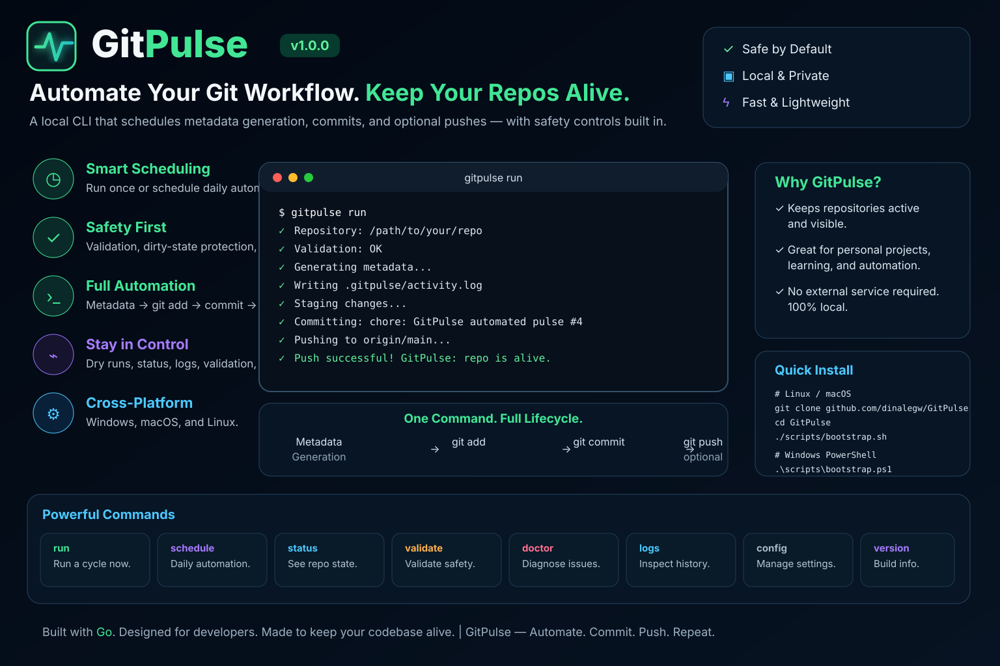

<div align="center">
  
</div>

# GitPulse

GitPulse is an open-source command-line application that automates scheduled
Git commits on repositories you choose.

It automates routine Git operations while giving you complete control over
which repository is used, how many commits are created, when commits occur,
and how commits are generated. GitPulse never performs actions without your
explicit configuration.

> **Important principle.** GitPulse is not a tool for deceiving GitHub or
> faking software development activity. It automates user-configured Git
> operations. You are responsible for ensuring that automated commits
> accurately reflect meaningful repository activity.

Developed by **BLACKSAUCE**

---

## Features

- **Interactive quick-run mode** — run `gitpulse` with no arguments and it
  walks you through repository path, commit count, interval, and message.
- Auto-detects Git repository in current directory and offers it as default.
- Smart repository path resolution: absolute paths, relative paths, `~`
  expansion, paths with spaces, and single-word folder names.
- Home-directory fallback: type a folder name like `Tatme` and GitPulse will
  automatically check `~/Tatme` if it doesn't exist in the current directory.
- Shell-command protection: inputs like `pwd`, `ls`, `cd`, `git status` are
  rejected with a helpful hint instead of being treated as paths.
- Pre-commit `git pull` syncs the local repository with the remote before
  any automated commits are created.
- README.md validation: warns if missing, offers to create one automatically.
- Dirty working tree protection: refuses to run if uncommitted changes exist.
- Detached HEAD detection: stops safely instead of creating commits in an
  ambiguous state.
- Bare repository detection: explains why GitPulse needs a working tree.
- Initialize GitPulse and store human-readable configuration.
- Configure a repository, remote branch, commits per day, schedule window,
  timezone, and logging level.
- Isolated commit strategy: automated changes live in a dedicated
  `.gitpulse/` metadata directory and never touch your source files.
- Automatically stage, commit, and push (once per cycle).
- Dry-run mode that simulates a full cycle without changing anything.
- Daily scheduler for running in the foreground on a schedule.
- Clear validation, status, logs, and health-check commands.
- Structured logging to a log file and the console.
- Cross-platform: Windows, macOS, and Linux.

## Installation

### Recommended: bootstrap installer

GitPulse is designed so a new machine does not need a manually assembled Go
environment. The bootstrap installer checks the host, installs missing
prerequisites where supported, provisions a compatible Go toolchain when
needed, downloads the dependencies declared by the project, builds GitPulse,
installs it, and runs `gitpulse doctor` as a post-install health gate.

**Linux / macOS:**

```sh
git clone https://github.com/dinalegw/GitPulse.git
cd GitPulse
chmod +x scripts/bootstrap.sh
./scripts/bootstrap.sh
```

**Windows PowerShell:**

```powershell
git clone https://github.com/dinalegw/GitPulse.git
cd GitPulse
Set-ExecutionPolicy -Scope Process Bypass
.\scripts\bootstrap.ps1
```

The default bootstrap path:

- requires Git for repository operations and installs it when the platform
  package manager supports automatic installation;
- uses Go 1.26.3 or newer;
- installs a private Go 1.26.3 toolchain when the system Go is missing or too
  old;
- downloads the exact dependency versions declared by `go.mod`/`go.sum`;
- builds a native GitPulse binary for the current machine;
- installs it under `~/.local/bin` by default;
- verifies the installation with `gitpulse version` and `gitpulse doctor`.

For an explicit dependency upgrade during bootstrap:

```sh
./scripts/bootstrap.sh --upgrade-deps
```

or on Windows:

```powershell
.\scripts\bootstrap.ps1 -UpgradeDeps
```

Dependency upgrades are deliberately opt-in. A reliable installer should
make the machine compatible first and reproducible second rather than blindly
upgrading unrelated packages.

See [docs/installation.md](docs/installation.md) for the complete
cross-platform installation and troubleshooting guide.

### From an existing Go checkout

If Go 1.26.3+ and Git are already installed:

```sh
go mod download
./scripts/build.sh
./scripts/install.sh
```

On Windows, use the native PowerShell bootstrap rather than executing the
Unix `build.sh` script directly from PowerShell.

### Verify

```sh
gitpulse version
gitpulse doctor
```

## Quick start

### Interactive mode (recommended)

Run `gitpulse` with no subcommand and it will prompt you for everything:

```text
Welcome to GitPulse Interactive Mode
=====================================
Developed by BLACKSAUCE
Version: GitPulse v1.0.0

Current directory: /home/user/GitPulse

Detected Git repository in current directory:
/home/user/GitPulse

Use this repository? [Y/n]: y

Repository: /home/user/GitPulse
Branch:     main
Remote:    origin
README:    README.md

Pulling latest changes from origin/main...
Repository is up to date with origin/main.

Number of commits: 2
Minutes between commits: 0
Commit message: chore: test

Starting: 2 commit(s) to /home/user/GitPulse
Interval: 0 minutes between commits
Message:  chore: test

[14:02:03] Creating commit 1 of 2...
[14:02:03] Created commit #1 (pushed: true)
[14:02:03] Creating commit 2 of 2...
[14:02:03] Created commit #2 (pushed: true)

=====================================
Done!
Total commits created: 2
Total commits skipped: 0
Pushed:                true
Duration:              21ms
Finished at:           2026-08-19 14:02:03 WAST
=====================================
```

If you type a single folder name like `Tatme`, GitPulse checks the current
directory first, then falls back to `~/Tatme` automatically.

If you accidentally type a shell command like `pwd` or `ls`, GitPulse will
reject it with a helpful hint instead of treating it as a path.

### CLI mode

```sh
# 1. Initialize a configuration for a repository.
gitpulse init --repo /path/to/repository

# 2. Check everything is wired up correctly.
gitpulse validate
gitpulse status

# 3. Simulate a commit cycle without touching anything.
gitpulse run --dry-run

# 4. Create commits now (stages .gitpulse/, commits, and pushes once).
gitpulse run

# 5. Run continuously on your configured daily schedule.
gitpulse run --schedule
```

## How it works

A single run (`gitpulse run`) creates the configured number of commits. Each
commit:

1. Appends one line to `.gitpulse/activity.log` in the repository.
2. Stages only the `.gitpulse/` directory.
3. Creates a conventional commit, e.g. `chore: GitPulse automated pulse #4`.
4. After the cycle, pushes once to the configured remote (skipped during
   dry-run or if no remote is configured).

Because only the metadata directory is staged, application source files are
never modified by GitPulse. If no remote is configured, pushing is skipped
with a warning.

Scheduled mode (`gitpulse run --schedule`) stays in the foreground and creates
one commit at each scheduled time: the configured `commits_per_day` events are
spread evenly across the `start_time`–`end_time` window (or spaced by
`commit_interval_minutes` if set). It requires `enabled: true`.

## Commands

| Command               | Purpose                                          |
|-----------------------|--------------------------------------------------|
| `gitpulse`            | Interactive quick-run mode (prompts for repo, commits, interval, message). |
| `gitpulse init`       | Create the configuration file.                   |
| `gitpulse config`     | Show the effective configuration.                |
| `gitpulse config set` | Change a single configuration value.             |
| `gitpulse run`        | Create and push a cycle of commits now.          |
| `gitpulse run --schedule` | Run continuously on the configured schedule (alias: `--daemon`). |
| `gitpulse status`     | Show repository, configuration, and schedule.    |
| `gitpulse logs`       | Show recent log entries.                         |
| `gitpulse validate`   | Validate the configuration and repository.       |
| `gitpulse doctor`     | Run environment and configuration health checks. |
| `gitpulse version`    | Print version and build information.             |
| `gitpulse help`       | Help for any command.                            |

Run `gitpulse help <command>` for usage, examples, and flags.

## Configuration

Configuration is stored as human-readable YAML, by default at
`~/.gitpulse/config.yaml`. Override the location with `--config` on any
command.

```yaml
enabled: true
repository_path: /home/alice/projects/app
remote_branch: main
commits_per_day: 4
commit_interval_minutes: 0
start_time: "09:00"
end_time: "18:00"
timezone: Local
dry_run: false
log_level: info
metadata_dir: .gitpulse
metadata_file: activity.log
push_remote: origin
commit_message_template: 'chore: GitPulse automated pulse #%d'
max_commits_per_cycle: 100
minimum_commit_interval_minutes: 1
```

See [docs/configuration.md](docs/configuration.md) for every key, its
default, and its meaning.

## Documentation

- [Installation](docs/installation.md)
- [Architecture](docs/architecture.md)
- [Configuration](docs/configuration.md)
- [CLI reference](docs/cli.md)

## Development

```sh
./scripts/test.sh       # go vet + go test ./...
```

The project uses conventional commits. See [CONTRIBUTING.md](CONTRIBUTING.md).

## Roadmap

See [ROADMAP.md](ROADMAP.md).

## Security

See [SECURITY.md](SECURITY.md). Report vulnerabilities privately.

## License

[MIT](LICENSE)
